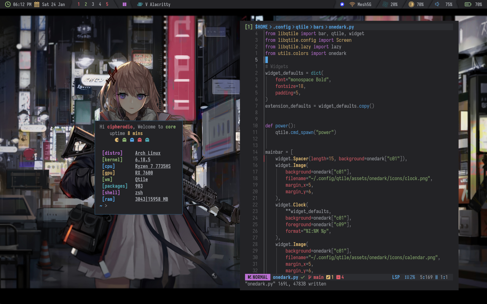

# 🍚 Arch Linux Dotfiles


## 📔 Overview

These are my personal configuration files (_dotfiles_) for [Arch
Linux][arch] and the [Qtile][qtile] window manager. System installation
and setup are guided by my [Archstrap guide][guide].

| **Dependencies**  | **Description**         |
| ----------------- | ----------------------- |
| Qtile             | Window manager          |
| Neovim            | Text editor             |
| Alacritty         | Terminal emulator       |
| Iosevka Nerd Font | Programming and UI font |

## 📸 Screenshots



## 🚀 Dotfiles Installation

I manage my dotfiles using a **Git bare repository** and a custom
wrapper script, [dot](.local/bin/dot). To configure a fresh system,
follow these steps:

```sh
# Bootstrap dotfiles and packages
curl -fsSL https://gitlab.com/cipherodio/archdots/-/raw/main/bootstrap.sh | bash
reboot

# Copy your SSH key to GitLab before running the setup.sh
cat ~/.ssh/gitlabkey.pub | xclip -selection clipboard

# Finalize setup and clone additional repositories
curl -fsSL https://gitlab.com/cipherodio/archstrap/-/raw/main/setup.sh | bash
```

## Credits

Qtile widgets inspired by
[@darkkal44](https://github.com/darkkal44/cozytile).

[arch]: https://archlinux.org/
[qtile]: https://qtile.org/
[guide]: https://gitlab.com/cipherodio/archstrap
