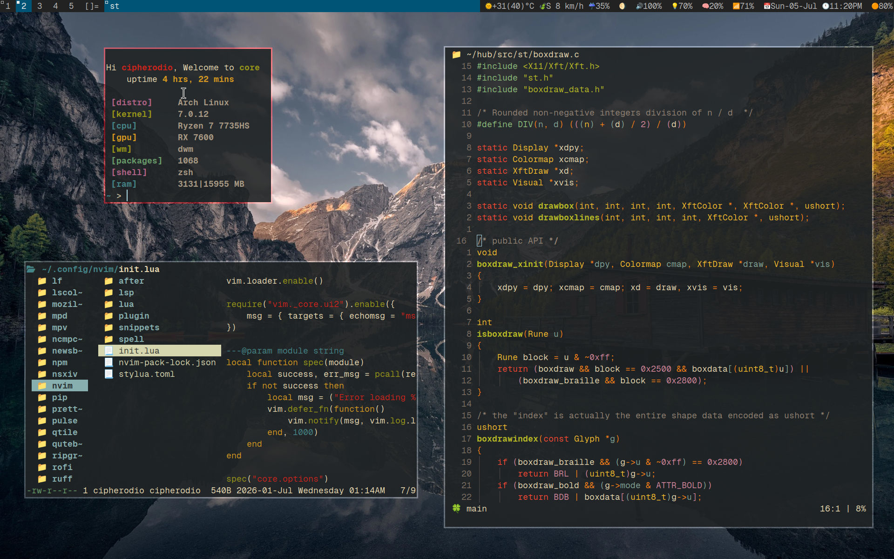
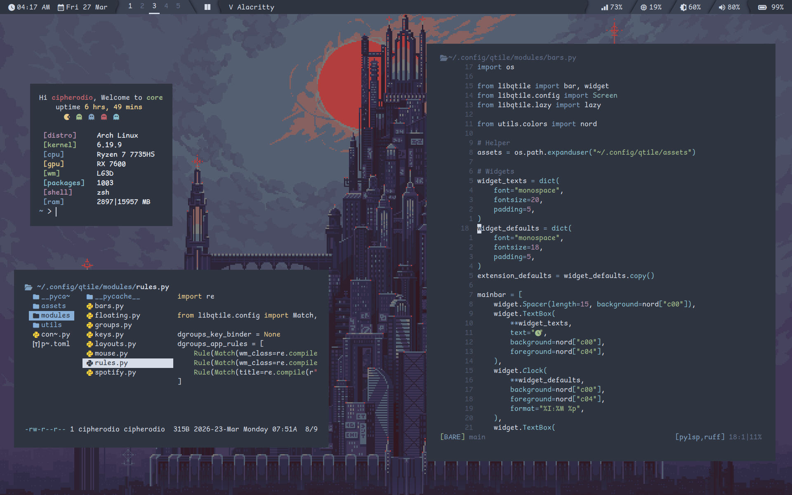
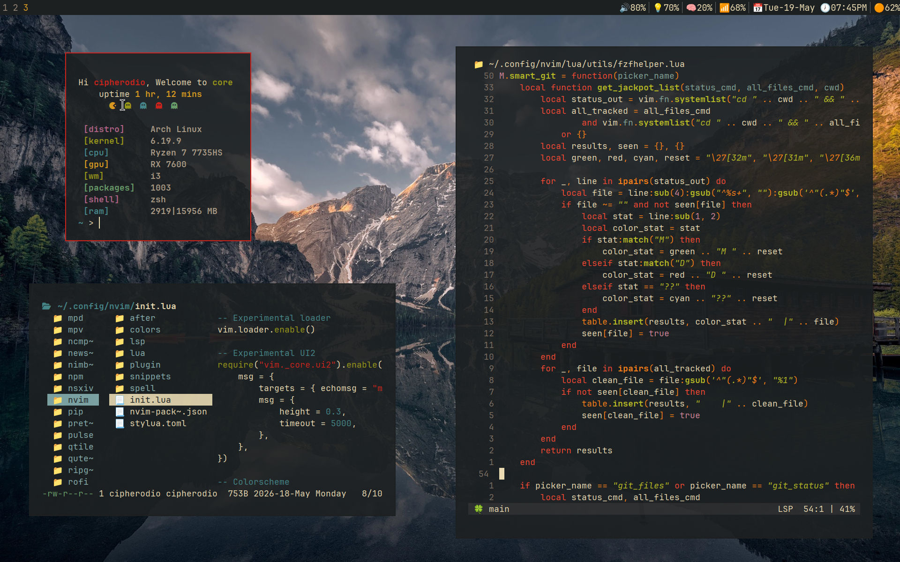

# 🍚 ARCH LINUX DOTFILES


## 📔 OVERVIEW

These are my personal configuration files (*dotfiles*) for
[Arch Linux][arch].

This repository includes configurations for three tiling window
managers:

- [DWM][dwm]
- [Qtile][qtile]
- [i3wm][i3wm]

System installation and environment deployment are guided by my
[Archstrap repository][guide].

| **Dependencies** | **Description**         |
| ---------------- | ----------------------- |
| DWM              | Window manager          |
| Neovim           | Text editor             |
| St               | Terminal emulator       |
| Geist Nerd Font  | Programming and UI font |

## 📸 DWM

Primary window manager.

[](.local/wallpapers/dwm.jpeg)

## 📸 QTILE

[](.local/wallpapers/qtile.jpeg)

## 📸 i3WM

[](.local/wallpapers/i3wm.jpeg)

## 🚀 DOTFILES INSTALLATION

I manage my dotfiles using a **Git bare repository** and a custom
wrapper script, [dot](.local/bin/dot).

To configure a fresh system, follow these steps:

```sh
# Bootstrap dotfiles and packages
curl -fsSL https://gitlab.com/cipherodio/archdots/-/raw/main/bootstrap.sh | bash
reboot

# Copy your SSH key to Gitlab before running the setup.sh
cat ~/.ssh/gitlabkey.pub | xclip -selection clipboard

# Finalize setup and clone additional repositories
curl -fsSL https://gitlab.com/cipherodio/archstrap/-/raw/main/setup.sh | bash
```

[arch]: https://archlinux.org/
[dwm]: https://dwm.suckless.org/
[qtile]: https://qtile.org/
[i3wm]: https://i3wm.org
[guide]: https://gitlab.com/cipherodio/archstrap
